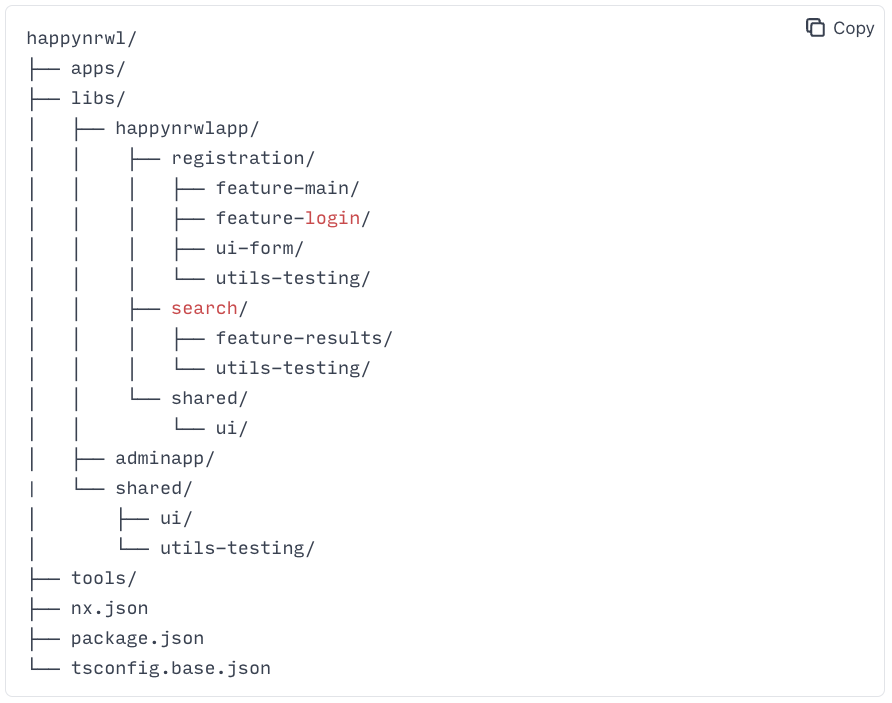

## Recipe

- Git
  - [Commit Message Guidelines](https://gist.github.com/brianclements/841ea7bffdb01346392c)
- Nx
  - [Mental Model](https://nx.dev/concepts/mental-model)
  - Core Features
  - Plugin Features
  - Conceipts
    - [Monorepos](https://nx.dev/more-concepts/why-monorepos)
    - _[Applications and libraries](https://nx.dev/more-concepts/applications-and-libraries)_
    - [Publishable and Buildable Nx Libraries](https://nx.dev/more-concepts/buildable-and-publishable-libraries)
    - Library
      - [Creating Libraries](https://nx.dev/more-concepts/creating-libraries)
      - [Library Types](https://nx.dev/more-concepts/library-types)
      - [Grouping Libraries](https://nx.dev/more-concepts/grouping-libraries)
    - [Using Nx at Enterprises](https://nx.dev/more-concepts/monorepo-nx-enterprise#code-organization-&-naming-conventions)
    - [Tag in Multiple Dimensions](https://nx.dev/recipe/tag-multiple-dimensions)
    - [Enforce Project Boundaries](https://nx.dev/core-features/enforce-project-boundaries)

## Best Practices



- importants
  - mental model
    - application
      - as containers, link, bundld and compile implemented in libraries
      - place 80% of your logic intor the libs/folder
      - and 20% into apps
    - libraries
  - library Types
    - feature
    - ui
    - data-access
    - utility
    - share

```shell
# --dry-run
nx g @nx/workspace:library feature-bank --dry-run --directory=account/mobile --tags=scope:mobile,type:feature

# directory: mobile/account/feature-bank , library-type: feature, name: feature-bank, tags: scope:mobile, type:feature
nx g @nx/workspace:library feature-bank --directory=account/mobile --tags=scope:mobile,type:feature

# directory: mobile/shared/ui , library-type: ui, name: ui tags: scope:mobile, type:ui
# dry run
nx g @nx/react:library ui --dry-run --directory=mobile/shared --tags=scope:mobile,type:ui
# run
nx g @nx/react:library ui --directory=mobile/shared --tags=scope:mobile,type:ui

# next.js add page
nx g @nx/next:page demo --project=admin

# next.js add component
nx g @nx/next:component protable --project=admin

```

[Using pnpm with Lerna
](https://lerna.js.org/docs/recipes/using-pnpm-with-lerna)
